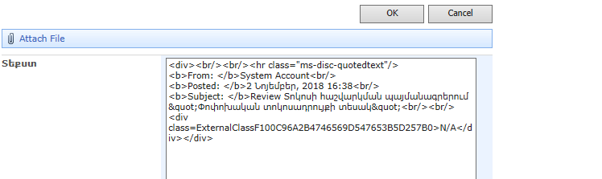
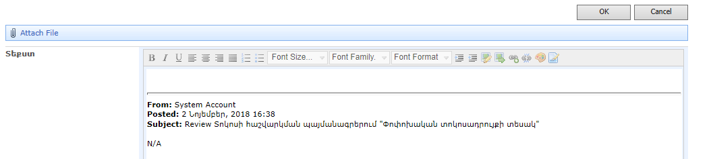

# SharePoint 2007 TextArea Enhancer Extension
Այս պրոյեկտով սարքում եմ Microsoft Edge-ի համար Extension, որը ՀԾ-ի spserver-ում TextArea դաշտերի փոխարեն տեղադրում է NicEdit խմբագրիչը:

Միակ chrome անունով branch-ի մեջ կատարված են փոփոխություններ, որպեսզի Extension-ը աշխատի Google Chrome-ի մեջ:

### Առանց Extension հարուստ խմբագրիչ չկա


### Տեղադրելուց հետո ավելանում է հարուստ խմբագրիչ


## Extension-ի հավաքելու քայլերը
Google Chrome-ի համար հարկավոր է միայն zip սարքել `src` ծրարի պարունակությունը։
Իսկ Microsoft Edge-ի համար պետք է հավաքել հատուկ AppX ֆայլ, դրա մասին ահագին գրված է Microsoft-ի օգնության էջերում՝ [Microsoft Edge extensions](https://docs.microsoft.com/en-us/microsoft-edge/extensions) և [Using ManifoldJS to create extension AppX packages](https://docs.microsoft.com/en-us/microsoft-edge/extensions/guides/packaging/using-manifoldjs-to-package-extensions):
Թեև հիշելու համար կգրեմ մանրամասն հրամաններով։

### Պետք է ունենալ սերտիֆիկատ ստորագրելու համար

#### (քայլ 1) պատրաստել սերտիֆիկատ PowerShell-ի միջոցով, պետք է կանգնած լինել այս ծրարի մեջ
```
New-SelfSignedCertificate -Type Custom -Subject "CN=STS, O=STS, C=AM" -KeyUsage DigitalSignature -FriendlyName STSFriendlyName -CertStoreLocation "Cert:\LocalMachine\My"
```

#### (քայլ 2) հիշել սկավառակի վրա `STS.pfx` ֆայլը, նախ նայել գեներացված սերտիֆիկատի Thumbprint-ը, այս դեպքում՝ `d33d93f008a8274952b475541e27badad1a2f968` էր 

```
$pwd = ConvertTo-SecureString -String 123 -Force -AsPlainText
```

```
Export-PfxCertificate -cert "Cert:\LocalMachine\My\d33d93f008a8274952b475541e27badad1a2f968" -FilePath C:\manifoldJSTest\STS.pfx -Password $pwd
```

### ManifoldJS-ի միջոցով պետք է գեներացնել AppX-ը (օգնության մեջ գրված էր, թե ինչպես տեղադրել ManifoldJS-ը համակարգչի մեջ)

#### (քայլ 1) manifest.json-ի հիման վրա Extension-ի փաթեթի ծրարի նախնական պատրաստում  (աշխատացնել PowerShell-ի կամ Command Prompt-ի միջից, պետք է կանգնած լինել այս ծրարի մեջ)
```
manifoldjs -l debug -p edgeextension -f edgeextension -m "src\manifest.json"
```

Կսարքի SharePoint2007TextAreaEnhancer անունով ենթածրարը, *բայց եթե ծրարը առկա լինի, ապա այս հրամանը թռնում է*։

#### (քայլ 2) ձեռքով փոխել դաշտերը գեներացված appxmanifest.xml ֆայլի մեջ, ստորև նշել եմ կարևոր փոխած տողերը
```
Name="SharePoint2007TextAreaEnhancer"   
Publisher="CN=STS, O=STS, C=AM"
<PublisherDisplayName>STS publisher</PublisherDisplayName>
<TargetDeviceFamily Name="Windows.Desktop" MinVersion="10.0.14393.0" MaxVersionTested="10.0.14393.0" />
```

#### (քայլ 3) ջնջել ավելորդ ֆայլերը Extension-ի ֆայլերի միջից
օրինակ՝ `.vs`, `tutorial`, կարելի է ջնջել մոլոր `*.ts` և `*.js.map` ֆայլերը։

#### (քայլ 4) սարքել վերջնական AppX ֆայլը դեռ չստորագրած (աշխատեց PowerShell-ի և Command Prompt-ի միջից)
```
manifoldjs -l debug -p edgeextension package SharePoint2007TextAreaEnhancer\edgeextension\manifest\
```

#### (քայլ 5) ստորագրել AppX ֆայլը 
Command Prompt-ի միջից
```
"C:\Program Files (x86)\Windows Kits\10\bin\x64\SignTool.exe" sign /fd SHA256 /a /f STS.pfx /p 123 SharePoint2007TextAreaEnhancer\edgeextension\package\edgeExtension.appx
```

PowerShell-ի միջից
```
& "C:\Program Files (x86)\Windows Kits\10\bin\x64\SignTool.exe" sign /fd SHA256 /a /f STS.pfx /p 123 SharePoint2007TextAreaEnhancer\edgeextension\package\edgeExtension.appx
```

### Ամենակարևոր քայլերը 4-ն ու 5-ն են, որ միշտ պետք է անել
Գուցե կառուցվածքը փոխեմ ու կարիք չլինի AppX ծրարը գեներացնելու և appxmanifest.xml ֆայլը ամեն անգամ ձեռքով փոխելու։ 
